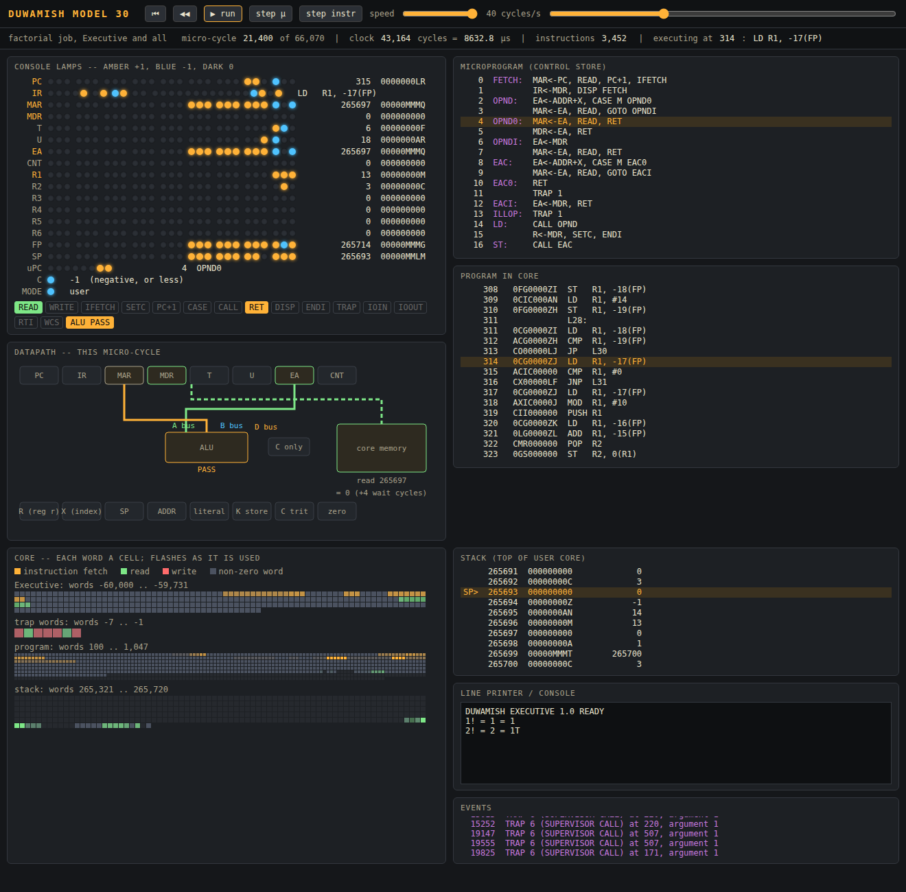

# Duwamish


**A balanced-ternary computer, designed as if in 1967, built as a
demonstrator of the ideas of I. J. Good and Douglas Hofstadter.**

Imagine that the Special Systems Section of Universal Entropics, Seattle,
had hired Knuth, Good, Ashby, Beer, Pask, Cray, Rosenblatt and Nelson to
design a "billion-dollar brain" on the lines of the Soviet Setun, using the
best practice of 1967 (the Section's house style is in
[docs/IDENTITY.md](docs/IDENTITY.md)).
This repository contains the whole machine, and software that runs on it:

| layer | |
|---|---|
| **Architecture** | 27-trit words; symmetric core of 3¹² words; nine registers; one-trit condition code; three-way `J3` jumps; `SEL` truth-table instruction; Kleene logic in hardware |
| **Model 30** | microprogrammed: a 156-word horizontal microprogram in a *writable* control store, with ternary micro-branching, cycle-exact timing |
| **Model 90** | hardwired, fast, and checked equivalent to the Model 30 by randomized testing; a balanced-ternary **floating-point unit** as standard (a feature on the Model 30); an optional **look-ahead unit** with a 32-word instruction stack |
| **Executive** | a resident monitor in protected core: traps, supervisor calls, time limits, accounting |
| **Satellite** | job control from card decks (`//JOB`, `//SALISH`, `//TRITRAN`, `//WHALE`, `//EXEC`, `//DATA`), and a card punch whose decks later steps can assemble (`//TRIAD PUNCHED`) |
| **TRIAD** | the symbolic assembler |
| **SALISH** | a BCPL-like language with three-valued logic, three-way `sign … of`, and **BlooP certification** of termination |
| **SALISH/O** | the optimising compiler: registers allocated by usage counts, index-register addressing, loop rotation, a peephole pass |
| **SALISH/S** | the SALISH compiler written in SALISH, optimiser included: it compiles itself on the Duwamish, card for card identical to the satellite's compilers, and builds a faster copy of itself |
| **TRILISP** | a LISP 1.5-style interpreter written in SALISH, with one-trit type tags, tail calls and garbage collection |
| **TRI-TRAN** | the Duwamish FORTRAN (1966): fixed-form cards, FORMAT, COMMON; three-valued LOGICAL; the arithmetic IF as one three-way jump; DO indices in index registers, as in FORTRAN I |
| **WHALE** | the Woodworth Heuristic Associative Learning Evaluator: SALISH with an associative store, as SAIL was ALGOL with LEAP. Facts are triples with weights of evidence in decibans, true, false or unknown by Wald's test |

## Quick start

Needs only Python 3.8+ and no packages.

```
python -m duwamish run jobs/tour.job --model 90        # the machine and its languages
python -m duwamish run jobs/hofstadter.job --model 90  # Goedel, quines, MIU, BlooP, halting
python -m duwamish run jobs/good.job --wcs             # evidence, Good-Turing, the explosion
python -m duwamish run jobs/go.job --model 90          # go, learned by self-play (about two minutes)
python -m duwamish run jobs/draughts.job --model 90    # Samuel's draughts learner (about four minutes)
python -m duwamish run jobs/chess.job --model 90       # Los Alamos chess (about a minute)
python -m duwamish run jobs/backgammon.job --model 90  # backgammon by self-play (about two minutes)
python -m duwamish run jobs/tower.job --model 90       # LISP in LISP in LISP (about a minute)
python -m duwamish run jobs/bootstrap.job --model 90   # the compiler compiles itself (a minute and a half)
python -m duwamish run jobs/improve.job --model 90     # ... and makes a faster copy of itself (four minutes)
python -m duwamish run jobs/copycat.job --model 90     # Copycat's analogies (half a minute)
python -m duwamish run jobs/fiveyear.job --model 90    # Good's five-year plan v. Shannon (six minutes)
python -m duwamish run jobs/tritran.job --model 90     # FORTRAN: a tour, Livermore, Good's FFT (half a minute)
python -m duwamish run jobs/perceptron.job --model 90  # Rosenblatt's perceptron v. Good's evidence (half a minute)
python -m duwamish run jobs/whale.job --model 90       # WHALE: weighed facts; a clinic that learns (40 seconds)
python -m duwamish run jobs/homeostat.job --model 90   # Ashby's homeostat: ultrastability (ten seconds)
python -m duwamish run jobs/knuth.job --model 90       # Kleene Life, 3-way sorting, ternary trees, radix 3
python -m duwamish run jobs/eliza.job --model 90       # ELIZA, the DOCTOR script (ten seconds)
python -m duwamish run jobs/gps.job --model 90         # GPS on the Tower of Hanoi
python -m duwamish run jobs/strips.job --model 90      # STRIPS plans for Shakey (about a minute)
python -m duwamish run jobs/shrdlu.job --model 90      # micro-SHRDLU's blocks world (half a minute)
python -m duwamish run jobs/prolog.job --model 90      # a three-valued Prolog (about a minute)
python -m duwamish run jobs/livermore.job              # Livermore loops (exact timing on Model 30)
python -m duwamish run jobs/livermore.job --model 90   # ... with the floating-point unit
python -m duwamish compile --opt programs/livermore.sal  # see what the optimiser does
python -m duwamish go programs/hello.sal               # run one program
python -m duwamish go --model 90 programs/tritran.ftn  # ... or one in TRI-TRAN
python -m unittest discover -s tests -t .              # the test suite
```

Options for `run` and `go`: `--model 30|90` (default 30); `--wcs` to turn
the writable-control-store key; `--fpu` or `--no-fpu` to fit or remove the
floating-point unit (by default the Model 90 has one and the Model 30 does
not); `--opt` to compile every SALISH step with the optimising compiler
(or put `OPT` on a `//SALISH` card); `--lookahead` to fit the Model 90's
look-ahead unit (a 32-word instruction stack); `--list` for listings.

## Inside the machine: the front-panel notebook



[`notebooks/duwamish.ipynb`](notebooks/duwamish.ipynb) opens up the machine.
It runs the real Model 30 micro-engine one micro-cycle at a time, records
everything the console would show, and replays it on an animated front
panel.
* **Lamps:** a ternary lamp for every trit of every register (amber +1,
  blue −1, dark 0), plus the condition trit, the mode, the
  micro-program counter and the control lines.
* **Datapath:** a diagram showing which registers drive the buses each
  cycle.
* **Listings:** the microprogram and the program, with the current line
  highlighted.
* **Core map:** flashes each word as it is fetched, read or written.
* **Controls:** run, pause, step one micro-cycle, step one instruction,
  scrub, and speed from 1 to 10,000 cycles a second.

Because it is a recording, the lamps light in exactly the order the
machine lit them. The notebook walks through:
1. trits and words;
2. the instruction format;
3. a ternary multiplication, microstep by microstep;
4. the layout of core;
5. a whole job, from Executive boot through supervisor calls and traps;
6. the two models and the Beer monitor;
7. the machine writing new microcode for itself;
8. the floating-point feature;
9. the compiler that compiles itself, and improves itself once;
10. Copycat's answers and temperatures;
11. where Good's five-year plan spends its search;
12. the look-ahead unit;
13. TRILISP's heap, animated through allocation and garbage collection;
14. TRI-TRAN, the Duwamish FORTRAN;
15. Rosenblatt's perceptron against Good's weight of evidence;
16. Kleene's logic in Conway's Life, animated: its fog beside the truth;
17. Ashby's homeostat, animated: meters, relays, uniselectors and a strip chart;
18. ELIZA;
19. a cell to load and watch your own program.

```
pip install notebook          # or jupyterlab; nothing else is needed
jupyter notebook notebooks/duwamish.ipynb
```

From Python, `duwamish.panel.save_html(recording, "panel.html")` writes a
front panel that opens in any browser.

## The demonstrations

See **[docs/DEMONSTRATOR.md](docs/DEMONSTRATOR.md)** for what each one
shows, and what it does not.

**Good**
* `explosion.sal`: the machine profiles itself, invents new microcoded
  instructions for its hottest code, *including the code of the improver
  itself*, and rewrites itself to use them. The gains converge to a fixed
  point, which shows exactly which premise of the intelligence-explosion
  argument is missing.
* `go.sal`: Good's game. The program learns 5×5 go by self-play, using
  randomized experiments and weights of evidence over 729 six-trit
  patterns. It goes from 8 to 20 wins in 20 against a random player, and
  shows the evidence for what it learned.
* `draughts.sal`: after Strachey and Samuel. Alpha-beta search plus an
  evaluation polynomial that learns by self-play, using Samuel's
  "generalization" and Alpha/Beta scheme. It discovers for itself which
  positional terms matter.
* `chess.sal`: Los Alamos chess (6×6, no bishops), as MANIAC I played it
  in 1956. It counts minimax against alpha-beta (85% saved at four plies,
  same answer), and a three-ply searcher mates a one-ply player.
* `fiveyear.sal`: two proposals from Good's "Five-Year Plan for Automatic
  Chess" (1968): follow lines by their probability of being played, and
  back up values allowing for a fallible opponent. Each plays Shannon's
  full-width search at equal effort. The first scores 3½ of 6, the
  second 1 of 6.
* `pfa.ftn`: Good's prime-factor ("interaction") algorithm of 1958, in
  TRI-TRAN. A Fourier transform of length 108 = 27 × 4 is done three ways:
  the direct sum, Cooley–Tukey with a radix-3 FFT and twiddle factors,
  and Good's index maps with no twiddles. Good's maps save 26% of the
  multiplications, but only 2.5% of the time. On a machine with a
  floating-point unit, multiplying was no longer the work.
* `perceptron.sal`: Rosenblatt's perceptron, in ternary: ink, paper and
  *unseen* on the retina; excitatory and inhibitory connections; and a
  response that can be "I do not know". Against it, Good's method with
  the same units: count their testimony once and add weights of evidence
  in decibans. Counting once matches 800 error corrections. With a third
  of the retina hidden, the evidence abstains where the perceptron errs,
  though it overstates its odds (the units are not independent
  witnesses). Minsky and Papert's limit follows: parity is learned only
  by units that see every point. Below that order, the ternary perceptron
  ends up answering "don't know" to all 32 patterns.
* `backgammon.sal`: a game of chance, learned by temporal-difference
  self-play with a single layer of ten weights. It goes from 0 to 7 wins
  in 16 against a hand-written evaluation.
* `banburismus.sal`: Turing and Good's weight of evidence in decibans, in a
  sequential test for messages "in depth"; the machine computes its own
  logarithms.
* `goodturing.sal`: estimating the probability of the unseen, checked
  against a known population (0.2280 estimated, 0.2292 true), and an
  honest failure on a text that violates the assumptions.
* `whale/diagnosis.whl`: a clinic in WHALE. It learns the weight of
  evidence of each finding from hospital records (flattened, as Good
  taught), diagnoses one question at a time until a diagnosis reaches
  20 db (Wald), and refers the patient when none does. Asking the
  question with the greatest expected weight of evidence (Good's
  "quasi-utility") takes 7.4 questions where a fixed order takes 10.3.
  Adding fixed weights instead of conditional ones costs wrong diagnoses.
  (`whale/tour.whl` shows the language: an open world of blocks, rules
  run to a fixed point, and glimpses that add up to a verdict.)

**Hofstadter**
* `selfref.sal`: Gödel's diagonal lemma, *executed*. A program solves for,
  writes and verifies a true statement of its own Gödel number.
* `quine.sal`: prints its own source, byte for byte.
* `miu.sal`: the MU puzzle. The invariant is one trit.
* `copycat.sal`: a cut-down Copycat. Codelets, a slipnet and a
  temperature answer "abc → abd; ijk → ?". It finds ijl, iijjll, lji and
  kjh, mrrkkk, and (rarely, but at the lowest temperature) mrrjjjj and
  wyz.
* `sequences.sal` / `floop.sal`: BlooP certified, FlooP refused.
* `metacircular.lsp`: a tower of interpreters with a strange loop at the top.
* `selfhost/salish.sal`: the SALISH compiler written in SALISH. On the
  Duwamish it compiles itself and punches 15,154 cards identical to the
  satellite's own compilation, so the next generation is the same program:
  the loop closes on itself (`jobs/bootstrap.job`). It carries the
  optimiser too, so it can build an optimised copy of itself, 16% faster
  and punching exactly the same cards. That copy's successor is itself:
  the improvement happens once and stops (`jobs/improve.job`).
* `diagonal.lsp`: Contracrostipunctus. A halting oracle and the record it
  cannot play.

**The rest of the committee**
* `ashby/homeostat.sal`: Ashby's homeostat. Four units whose uniselectors
  have 27 positions, one for each 3-trit wiring, and a relay that reads a
  trit. It hunts through random wirings until every needle stays in
  bounds. It rides out disturbances, and re-adapts when the experimenter
  reverses a connection.
* `knuth/life.sal`: Conway's Life, 27 cells to a word. Live is +1 and
  dead −1, so AND, OR, EQV and negation are a Boolean algebra, and 0 is
  an *unknown* cell. Kleene's logic is sound: checked against every world
  the unknown cells could stand for, whatever it calls alive or dead is
  so. But it is badly incomplete: at generation 8 it leaves 124 cells
  unknown where in truth 7 are. Both pictures are printed.
* `knuth/sorting.sal`: quicksort and heapsort when a comparison has three
  outcomes and J3 branches on all of them. Three-way partitioning is 7
  times faster on trit-valued keys, but Hoare's two-way scans win on
  distinct ones. The ternary heap makes the fewest comparisons, the 4-ary
  the fewest moves.
* `knuth/tst.sal`: a ternary search tree of the words of Genesis 1, one
  J3 per node, with prefix and pattern search.
* `knuth/fft23.ftn`: is radix 3 the right FFT for a ternary machine? It
  needs 1.35 times radix 2's multiplications for the same work, but
  0.86 times the cycles, because it makes fewer passes over the data.

**The AI of the period, in TRILISP** (`programs/ai/`)
* `eliza.lsp`: ELIZA and the DOCTOR script. It reproduces the
  conversation in Weizenbaum's 1966 paper word for word.
* `gps.lsp`: the General Problem Solver's means-ends analysis on the Tower
  of Hanoi, with states as trit words.
* `strips.lsp`: STRIPS plans Shakey's ten steps to turn on a light it
  cannot reach, then carries them out, checking each precondition.
* `shrdlu.lsp`: micro-SHRDLU follows the first dozen exchanges of
  Winograd's dialogue, from "I DON'T UNDERSTAND WHICH PYRAMID YOU MEAN"
  to "I DON'T KNOW".
* `prolog.lsp`: a Prolog with three answers, TRUE, FALSE and UNKNOWN,
  beside ordinary Prolog's. It will not say Tweety flies when it does not
  know Tweety is no penguin, and it answers UNKNOWN where Prolog would
  loop.

## How fast is it?

`programs/livermore.sal` runs six of the Livermore Fortran Kernels, the
loops by which the CDC 7600 was judged. It runs them three ways: in fixed
point, in a software ternary floating point (`duwamish/lib/tfloat.sal`),
and on the hardware floating-point unit, with answers checked against
double precision. The job compiles it twice, plainly and with SALISH/O.

| Model 90, harmonic mean MFLOPS | fixed point | software float | FPU |
|---|---:|---:|---:|
| plain SALISH | 0.070 | 0.0064 | 0.065 |
| SALISH/O | 0.184 | 0.0078 | 0.216 |
| SALISH/O, with the look-ahead unit | 0.264 | 0.0080 | 0.315 |
| TRI-TRAN (the same kernels in FORTRAN) | | | 0.215 |
| TRI-TRAN, with the look-ahead unit | | | 0.267 |

The unit made floating point ten times faster, but under the plain
compiler no faster than fixed point: the machine was limited by issuing
one instruction at a time. The optimiser cut the inner product from 20
instructions a pass to 6, which gains another factor of 3.3. The
look-ahead unit's instruction stack, after the CDC 6600, lets such a loop
run without fetching instructions from core, for another 45%. TRI-TRAN,
with FORTRAN I's single idea of keeping loop indices in index registers,
gets within 1% of SALISH/O, and computes the same words to the last trit. The 7600's
peak was about 36 MFLOPS, about 115 times faster than the best Duwamish.
See [docs/ARCHITECTURE.md §12](docs/ARCHITECTURE.md) for the full
comparison.

## Documentation

* [docs/ARCHITECTURE.md](docs/ARCHITECTURE.md): principles of operation, as
  the committee's report
* [docs/SALISH.md](docs/SALISH.md), [docs/TRILISP.md](docs/TRILISP.md),
  [docs/TRITRAN.md](docs/TRITRAN.md) and [docs/WHALE.md](docs/WHALE.md):
  the language manuals
* [docs/DEMONSTRATOR.md](docs/DEMONSTRATOR.md): the principles and their
  demonstrations
* [docs/IDENTITY.md](docs/IDENTITY.md): the house style of the Special
  Systems Section, which built the machine

## Layout

```
duwamish/            the machine: ternary.py isa.py microasm.py machine.py
                     triad.py salish.py optimise.py tritran.py whale.py
                     satellite.py fpu.py
                     executive.tri profile.py
                     panel.py (the recorder and animated front panel),
                     heapview.py, lifeview.py, homeoview.py (animations
                     of TRILISP's heap, Kleene Life and the homeostat)
notebooks/           duwamish.ipynb, the machine made visible
duwamish/microcode/  model30.dmc, the microprogram
duwamish/lib/        runtime.sal, disasm.sal, trilisp.sal, tfloat.sal,
                     tritran.sal (TRI-TRAN's FORMAT and mathematical library),
                     whale.sal (WHALE's associative store)
docs/images/         the Section's mark and signature (ue-mark.svg, ue-logo.svg)
programs/            SALISH, TRILISP, TRI-TRAN (.ftn) and WHALE (.whl)
                     programs (good/, hofstadter/, ashby/, knuth/, ai/,
                     whale/, trilisp/,
                     selfhost/: the compiler in SALISH)
jobs/                card decks
data/                Genesis 1 (KJV), for Good-Turing
tests/               unittest suite
tools/               make_quine.py (how the quine was built),
                     make_notebook.py (how the notebook is generated)
```

*The committee and its report are fiction. The ideas credited to each
member are their real published views; the design and code are new.*
